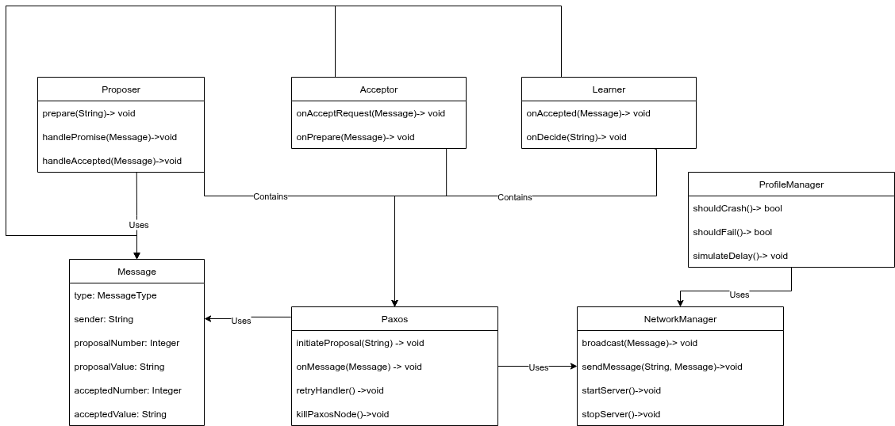

# Design
## Paxos Implementation details
The Proposal Number needs to be monotonically increasing across all members this ensures that a single
value can be elected based off simple `>` comparisons electing the candidate with the greatest candidate number.
In order to achieve this the current time in milliseconds was utilised. This should ensure that requests have 
differing values and that a single candidate can be chosen.
  
The Quorum Size was calculated as the number of members present in the config file (N) 
divided by 2 plus 1 i.e. `(N/2)+1` this ensures that there will only ever be one value 
learned as a minimum of half the original member pool must select a value. 
There was a potential to make N dynamic with the number of members that are still available (can communicate with)
however this may defeat the purpose of the paxos algorithm as if only one node of 10 is active the program shouldn't 
decide on a value.
  
After a proposal is made nodes will start a retry timeout after 5 seconds plus jitter up to 1 second. 
This ensures that if a node starts a proposal but crashes a value will still be decided on with clients 
starting their own proposals. Jitter was applied in order to reduce the amount of wasted proposals.
## Class Details
 
The above is a rough diagram of how each component is utilised and connected in the implementation.

The **Message** class offers consistent communication through a simple interface and reduces the complexities associated with inheritance.
 
The **NetworkManager** allows for messages to be handled and distributed accordingly via the 
Paxos class and allows for the different roles (Proposer, Acceptor and Learner) to send messages. 
Having all traffic go through the manager ensures information such as which clients are active can be tracked 
and separates information such as how each node can be accessed.
 
The **Paxos** class is allocates messeges to their respective handlers and initializes the roles in 
accordance with input parameters and the size of the network. 
The Paxos class also will start a new proposal if a failed proposal is identified, ensuring a consensus is reached.
 
The **Proposer**, **Learner** and **Acceptor** handle their respective messages and states. 
Separating these out from each other allowed for greater ease of implementation and modification.
 
The **ProfileManager** is mainly implemented for testing as it enforces constraints such as delays, 
crashes and dropped messages depending on the profile in use. This allows for testing of different capabilities.

